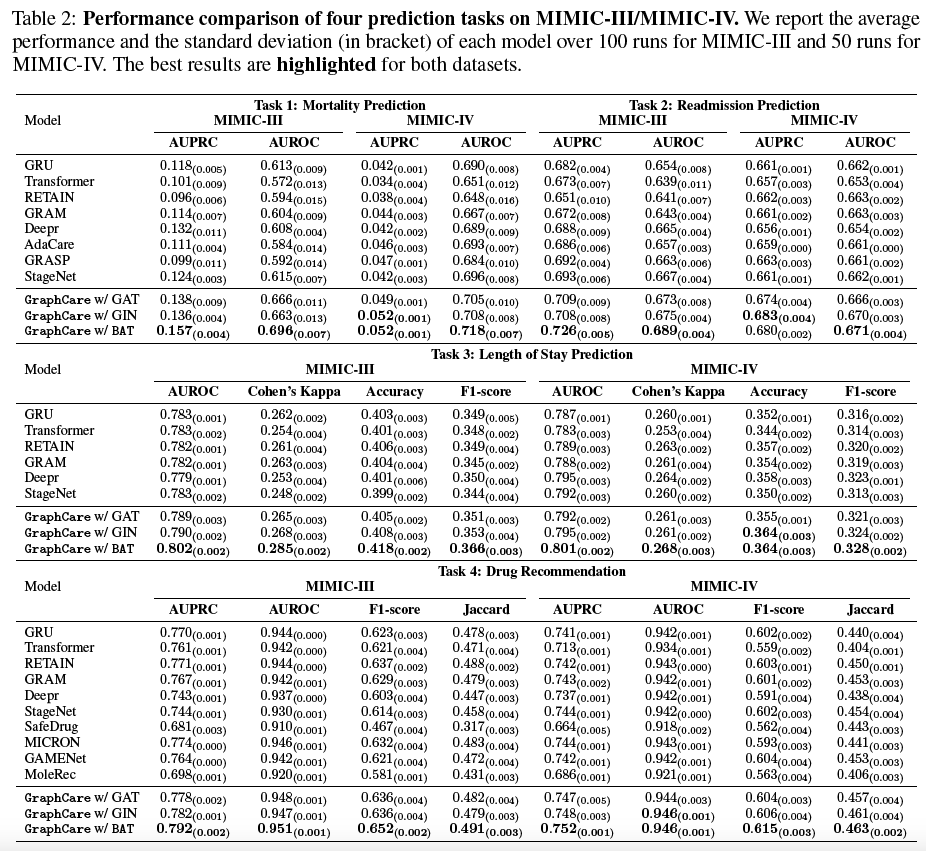

# GraphCare
Source code for our paper: "GraphCare: Enhancing Healthcare Predictions with
Open-World Personalized Knowledge Graphs".

Requirements:
``` bash
pip install torch==1.12.0
pip install torch-geometric==2.3.0
pip install pyhealth==1.1.2
pip install scikit-learn==1.2.1
pip install openai==0.27.4
```

We follow the flow of methodology section (Section 3) to explain our implementation.

## 1. Concept-specific Knowledge Graph (KG) Generation
### 1.1 LLM-based KG extraction via prompting
The jupyter notebook to prompt KG for EHR medical code:

``` bash
/graphcare_/graph_generation/graph_gen.ipynb
```

### 1.2 Subgraph sampling from existing KGs
The script for subgraph sampling from UMLS:
``` bash
/KG_mapping/umls_sampling.py
```

### 1.3 Word Embedding Retrieval for Nodes & Edges
The jupyter notebooks for word embedding retrieval:
``` bash
/graphcare_/graph_generation/{cond,proc,drug}_emb_ret.ipynb
```

### 1.4 Node & Edge Clustering
The function for node & edge clustering:
``` bash
clustering() in data_prepare.py
```

## 2. Personalized Knowledge Graph Composition
``` bash
process_sample_dataset() and process_graph() in data_prepare.py
&
get_subgraph() in graphcare.py
```

## 3. Bi-attention Augmented (BAT) Graph Neural Network
The implementation of our proposed BAT model is in
``` bash
/graphcare_/model.py
```

## 4. Training and Prediction
The creation of task-specific datasets (using PyHealth) is in 
``` bash
data_prepare.py
```
The training and prediction details are in
``` bash
graphcare.py
```

## Run Baseline Models
The scripts running baseline models are placed in 
``` bash
/baselines
```

We show precise (three decimal digits) results (equivalent to Table 2 in the paper) as follows:

